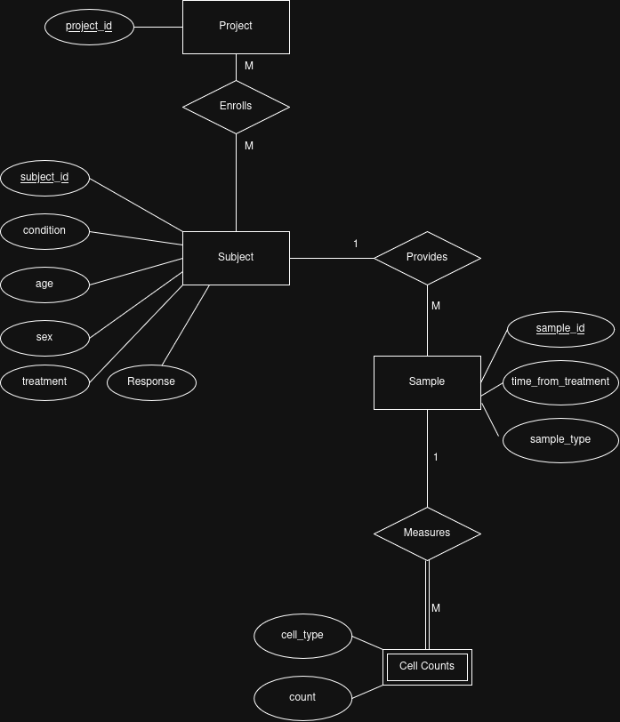
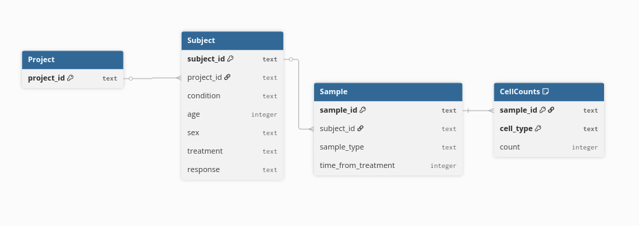

## Link to Deployed App:
https://tekoas5essment.streamlit.app/


## How to Run

This project was designed and tested in **GitHub Codespaces**
**Environment:**
- Python 3.12.1
- Dependencies (see requirements.txt)

**Steps:**

```bash
make setup      # Install dependencies from requirements.txt
make pipeline   # Initialize the database, load data, and generate all outputs
make dashboard  # Launch the Streamlit dashboard at localhost:8501
```

The `pipeline` step is fully automated — no manual intervention required. It will delete any existing `teiko.db` and regenerate all files in `outputs/`.

## Code Structure

The Makefile orchestrates three python files with unique tasks

- **`load_data.py`** — Initializes the SQLite database (`teiko.db`) and loads `cell-count.csv` into four normalized tables: `projects`, `subjects`, `samples`, and `cell_counts`.

- **`analysis.py`** — Queries the database to produce all analytical outputs. Performs summaries, filtering steps, and statistical tests. All results are stored as tables in the `outputs/` directory

- **`app.py`** — Streamlit dashboard that reads the CSVs from `outputs/` and renders interactive visualizations. Additionally records my own interpretation of results.

This pipeline design — ingest → analyze → visualize as three separate steps — keeps each concern isolated and makes it easy to rerun just the analysis or just the dashboard without touching the database.

## Explanation of Relational Database Schema

I tried to strike some balance between potential for maximum scalability in this schema, and the targeted nature of this assignment.

In a real-world system, the Project entity would carry attributes like start date, end date, principal investigator, and sponsoring institution. The current dataset does not provide this information, so those columns are absent rather than populated. Still I decided to keep it as an entity in the name of expandability. Another tweak I made in the name of expandability was to include cell counts as a weak entity, with attributes of individual cell counts rather than having cell counts be attributes of samples. Across different projects there may be interests in other cell types than the ones in this dataset. It may also make queries cleaner. for example, using WHERE clause on a long table rather than checking five separate columns with OR conditions.

Additionally, in the real world a single patient may appear in multiple projects (unless there is a policy to not include the same patients across different projects that was not specified in the assignment). A patient's condition, treatment, and response can all change over time. In a real world scenario, I might choose to handle this by adding an Enrollment entity that sits between Subject and Project, carrying treatment, response, and condition as attributes of a given enrollment rather than of the subject themselves. However, in this dataset each subject appears in exactly one project, so enrollment collapses into subject without any loss of information.

I went back and forth on making a treatment entity because in real life, there would be likely be additional data for treatments. Again, due to the fact that I don't know what those attributes would be, and to avoid single column tables, I included treatment and response as subject attributes to avoid unnecessary complexity in this case.




